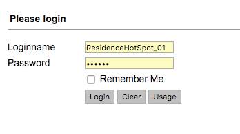
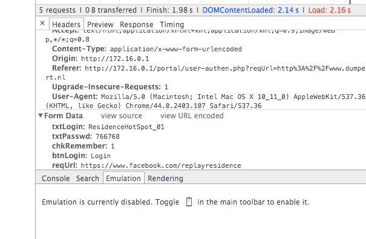
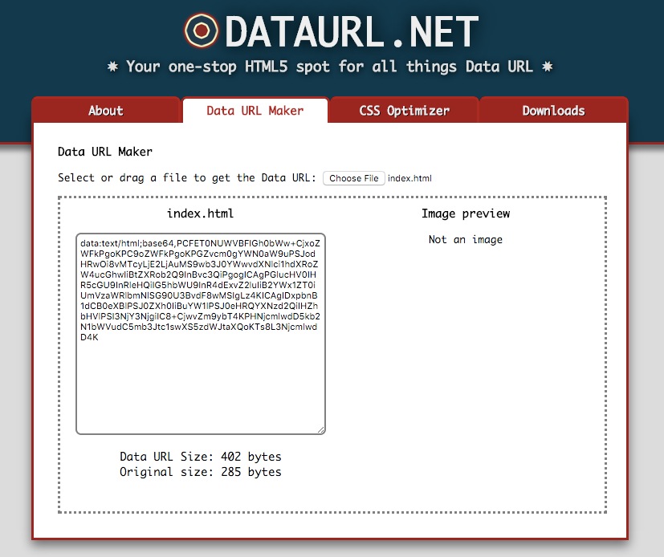

# No Wifi Popup - Automatically connect to your hotel's WiFi network

I'm highly frustrated with wifi popups in hotels and cafes. I quickly hacked
a solution together as a proof of concept.
You edit the network's post-values and it's URL, and it will send a POST
request to your router to authenticate. 

Here follows a detailed description.

## 1. Open the wifi-popup like you always would


## 2. Login and see the sent headers in the browser's network console


## 3. Edit the headers in index.html
Here is a sample of the code. Deep inside you'll know what to do.
```
...
<form action="http://172.16.0.1/portal/user-authen.php" method="post">
    <input type="text" name="txtLogin" value="ResidenceHotSpot_01" />
    <input type="text" name="txtPasswd" value="766768" />
</form>
...
```

## 4. Convert your index.html with your settings to a data-url for offline available access
Your phone can't access the web-app without internet. Therefore we convert your  
HTML document (with your settings) to a data URL at
[dataurl.net](http://dataurl.net/) so your phone can access it offline-available.


## 5. Email the data URL to yourself on your phone, and save the app to your homescreen for easy access 


## 3. It works, WIN!

