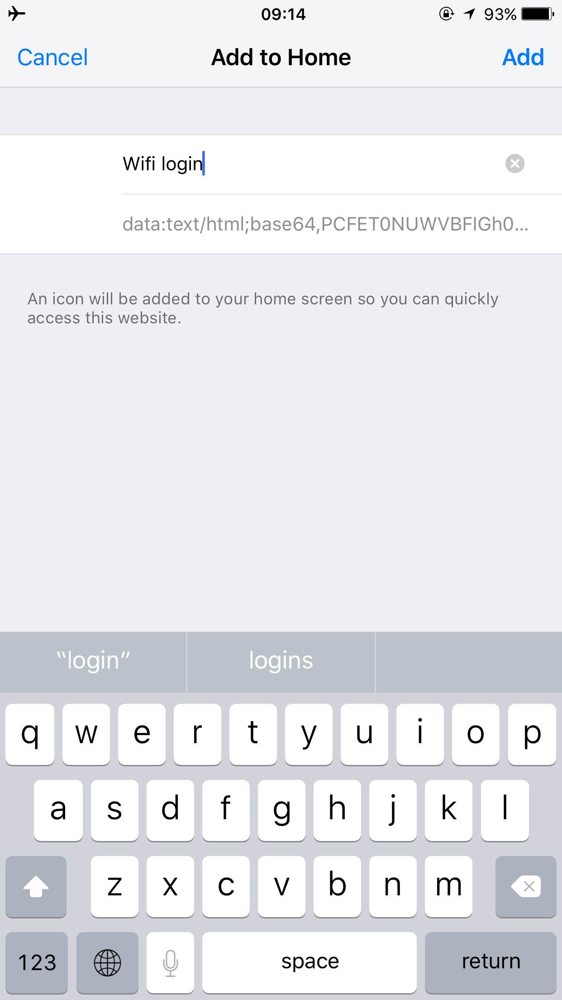

# No Wifi Popup - Automatically connect to your hotel's WiFi network

I'm highly frustrated with wifi popups in hotels and cafes. They:
- never open a pop-up to connect when you need them
- don't remember the data you entered (even though you checked 'remember me')
- you never know when you lost connection when using https, you just wait until
    the connection times out.
- they don't work nicely when using an alternative DNS.

I quickly hacked a solution together as a proof of concept. They only tackle
the first two problems.  You edit the network's post-values and it's URL, and
it will send a POST request to your router to authenticate. 

Here follows a detailed description.

## 1. Open the wifi-popup like you always would


## 2. Login and see the sent headers in the browser's network console


## 3. Edit the headers in index.html
Here is a sample of the code. Deep inside you'll know what to do.
```
...
<form action="http://172.16.0.1/portal/user-authen.php" method="post">
    <input type="text" name="txtLogin" value="ResidenceHotSpot_01" />
    <input type="text" name="txtPasswd" value="766768" />
</form>
...
```

## 4. Convert your index.html with your settings to a data-url for offline available access
Your phone can't access the web-app without internet. Therefore we convert your  
HTML document (with your settings) to a data URL at
[dataurl.net](http://dataurl.net/) so your phone can access it offline-available.


## 5. Email the data URL to yourself on your phone, and save the app to your homescreen for easy access 
Do it in airplane mode, the app will redirect you to the form. Simply go back
one page and add the webpage to your homescreen.


## 6. It works, WIN!
Now simply open the bookmark on your homescreen, and the app will authenticate
you to the network.

